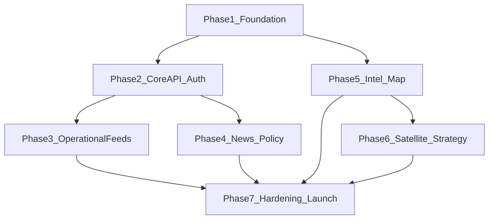

# DRIS / EDR Dashboard — Overall Completion Roadmap

This document defines **what “done” means** and **ordered phases** to get from today’s functional SPA to a **complete, deployable product** SkillVantage can operate. It aligns [INTEL_PLATFORM_ROADMAP.md](./INTEL_PLATFORM_ROADMAP.md), core LTDRR features, news/data work, and production concerns.

---

## What “completion” means (working definition)

| Tier | Meaning |
|------|--------|
| **MVP complete** | Real users can sign in, edit scorecards/inventory for their jurisdiction, data persists in **your** backend, Intel and Overview work with **configured** feeds and news (no dead demos blocking demos). |
| **Pilot complete** | Above + role boundaries enforced + audit trail + backup story + one deployment environment stakeholders trust. |
| **Production complete** | Above + observability, security review remediations, support/runbooks, SLAs for critical flows, and documented data retention. |

Use this doc to sequence work; dates are for your team to assign.

---

## Current snapshot (baseline)

- **Core:** Parishes (and optional USA-states test mode), scorecard domains, equipment/personnel UI — persistence today is largely **browser `localStorage`** (documented as interim).
- **Intel:** Map with flights, ships, GDACS, earthquakes, webcams, geocode, news-by-bbox via **`VITE_NEWS_API_URL`**; some layers depend on API keys and rate limits.
- **Content:** Protocols, contacts, alerts/weather/communications — **mix of live APIs and demo/static** (optional keys and contracts in [MANUAL_SETUP.md](../MANUAL_SETUP.md)).

---

## Phase 1 — Foundation & developer velocity

**Goal:** Anyone can build, deploy, and configure the app safely.

- Repo ownership, branching, protected `main`, tagged releases.
- **Environment matrix:** document all `VITE_*` and server env vars; `.env.example` kept current.
- **CI:** install + `npm run build` on every PR; optional lint.
- **Hosting:** production deploy (e.g. Vercel) with env vars set; preview deploys for PRs.
- **Secrets:** no keys in client that should be server-only; pattern for **serverless proxies** (news, AIS, future imagery tiles if needed).

**Exit criteria:** Repeatable build and deploy; new engineer can run locally from [`docs/overview.md`](./overview.md) + `.env.example`.

---

## Phase 2 — Core product: authoritative data & users

**Goal:** DRIS is not “one browser’s data.”

- **Backend + database** for scorecards, equipment, personnel, change history (replace or sync from `localStorage`).
- **Authentication** (government SSO, Entra, or email magic link — pick one for pilot).
- **RBAC** aligned with `userRoles.js`: parish/state scope, read-only vs editor; enforce on **API**, not only UI.
- **Jurisdiction model:** Jamaica production paths + optional US dataset flags if still needed for sales/engineering.

**Exit criteria:** Two test users in different roles cannot overwrite each other’s data; data survives cache clear; export or backup path exists.

---

## Phase 3 — Operational truth: alerts, weather, communications

**Goal:** Overview and parish views reflect **real** situational context where contracts allow.

- Replace or supplement **demo** weather/alerts/communications with **official or licensed feeds** (ODPEM, NHC/CAP, Met Service, FEMA-style CAP where applicable).
- Standardize **timestamps, sourcing, and “last updated”** in UI.
- **Emergency banner** (and similar) driven by API/admin workflow, not only `localStorage`.

**Exit criteria:** Stakeholders agree which sources are authoritative for v1; UI clearly labels source and freshness.

---

## Phase 4 — News & aggregated intel (value filter)

**Goal:** News supports decisions, not noise.

- **Single backend contract** for news (bbox + limit + optional region id), as already sketched in `newsFeed.js` / `api/news.js`.
- **Policy:** allowlist sources, dedupe, scoring, recency — extend region-specific keywords (Jamaica vs US), not hard-coded to one island only.
- **Caching** at the edge (short TTL) to respect upstream limits.
- Optional: **curated** bulletins from SkillVantage layered above raw news.

**Exit criteria:** News panel stable under pilot load; empty/error states tested; ToS/rate limits documented.

---

## Phase 5 — Intel platform completion (map & feeds)

**Goal:** Intel matches the technical roadmap in [INTEL_PLATFORM_ROADMAP.md](./INTEL_PLATFORM_ROADMAP.md).

Suggested **implementation order** (same spirit as §7 there):

1. **Map-bounds–driven** flight (and ship) fetches for pan/zoom anywhere.
2. **Search + flyTo** (geocode already partially present — unify behavior).
3. **Click-to-area + “Feeds for this area”** panel (counts, weather snippet, cameras).
4. **Weather radar overlay** (RainViewer or OWM tile layer).
5. **Real AIS** (AIS Stream or AISHub + proxy if CORS/key issues).
6. **GDACS / USGS** as first-class overlays (bbox-filtered where possible).
7. **Cameras near point** (existing patterns — consolidate list UX).

**Exit criteria:** Intel usable for a tabletop exercise: locate area → see movement + hazards + weather context + relevant headlines.

---

## Phase 6 — Satellite & basemap strategy

**Goal:** Clarify **what “satellite” is for** — operations vs presentation.

- **Basemap / globe:** Mapbox (already used) vs alternatives — decision record: style IDs, costs, attribution.
- **Radar / precipitation:** tile overlays (Phase 5), distinct from **EO satellite** products.
- **EO analytics** (damage assessment, change detection): usually **separate** vendors (Sentinel, Planet, etc.) — only if product scope includes it; not required for “Intel map complete.”

**Exit criteria:** Written decision: which layers ship in v1; costs approved; attribution strings in UI.

---

## Phase 7 — Hardening & launch readiness

- **Security:** dependency audit, headers/CSP as appropriate, pentest fixes tracked.
- **Observability:** client error reporting, basic API/logging for serverless routes.
- **Accessibility:** primary flows keyboard/screen-reader pass.
- **Documentation:** operator runbook, data dictionary for scorecard domains, incident response contacts.
- **Training:** short deck or video for parish/state coordinators.

**Exit criteria:** Go-live checklist signed off; rollback path known.

---

## Dependency view (high level)

Phases **3–5** can overlap once **Phase 2** is underway (different owners).

---

## Success metrics (suggested)

| Area | Metric |
|------|--------|
| Core | % jurisdictions with at least one scorecard save in DB (not only local demo) |
| Intel | Median time to answer “what’s happening here?” (search/flyTo → meaningful panel) |
| News | % sessions with ≥1 click-through to trusted source; error rate on news API |
| Ops | MTTR for sev-2 incidents; zero undeployed hotfixes older than 48h on pilot |

---

## Related documents

- [INTEL_PLATFORM_ROADMAP.md](./INTEL_PLATFORM_ROADMAP.md) — Intel technical layers and file-level hints  
- [NEW_FEATURES.md](../NEW_FEATURES.md) — feature inventory and historical “what changed” notes  
- [overview.md](./overview.md) — product overview and stack  

---

*Last updated: maintain this file when phases complete or scope changes.*
